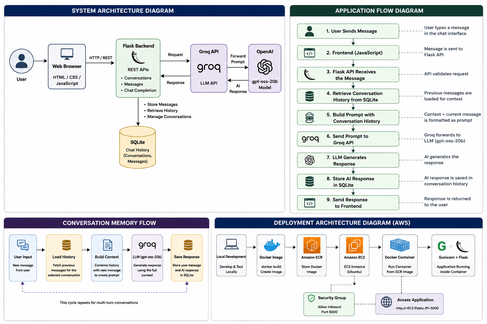

# Sarvam Maya – Conversational GenAI Assistant

A Flask-based conversational AI web application that provides multi-turn conversations using a Groq-hosted OpenAI open-weight model. The application maintains conversation history using SQLite and is containerized with Docker for cloud deployment on AWS.

## 🚀 Features

* Conversational AI chat interface
* Multi-turn conversation support
* Persistent conversation history using SQLite
* Conversation thread creation and management
* REST APIs using Flask
* Groq API integration
* OpenAI `gpt-oss-20b` model
* Responsive web interface using HTML, CSS and JavaScript
* Docker containerization
* Gunicorn production server
* AWS ECR container image storage
* AWS EC2 deployment

## 🏗️ System Architecture

The following diagram illustrates the complete architecture of the Sarvam Maya application, including the Flask backend, SQLite conversation memory, Groq API, OpenAI `gpt-oss-20b` model, Docker containerization, Amazon ECR, and AWS EC2 deployment.



## ☁️ AWS Deployment Architecture

The application was containerized using Docker and deployed on AWS EC2. The Docker image was pushed to Amazon ECR and then pulled and executed on the EC2 instance.


## 🛠️ Technology Stack

| Technology           | Purpose                                    |
| -------------------- | ------------------------------------------ |
| Python               | Application development                    |
| Flask                | Backend web framework and REST APIs        |
| HTML/CSS             | User interface                             |
| JavaScript           | Frontend interaction and API communication |
| SQLite               | Conversation and message storage           |
| Groq API             | LLM API access                             |
| OpenAI `gpt-oss-20b` | Language model                             |
| Docker               | Application containerization               |
| Gunicorn             | Production WSGI server                     |
| Amazon ECR           | Docker image registry                      |
| Amazon EC2           | Cloud deployment                           |
| Git/GitHub           | Version control and source code management |

## 📁 Project Structure

```text
SarvamMaya/
│
├── app.py
├── model.py
├── config.py
├── requirements.txt
├── Dockerfile
├── .dockerignore
├── .gitignore
│
├── static/
│   ├── script.js
│   └── styles.css
│
├── templates/
│   └── index.html
│
└── readme
```

## 🔄 Application Flow

When a user sends a message:

```text
User Message
     │
     ▼
JavaScript Frontend
     │
     ▼
Flask REST API
     │
     ▼
Retrieve Conversation History
     │
     ▼
Build Prompt / Context
     │
     ▼
Groq API
     │
     ▼
OpenAI gpt-oss-20b
     │
     ▼
Generated Response
     │
     ▼
Store Response in SQLite
     │
     ▼
Return Response to Browser
```

## 💾 Conversation Memory

The application uses SQLite to maintain conversation history.

Each conversation is associated with a unique conversation thread. Previous messages from the selected thread are retrieved and included as context when generating the next response.

This allows the assistant to maintain context across multiple messages.

## 🐳 Docker

The application is containerized using Docker.

Build the image:

```bash
docker build -t sarvam-maya .
```

Run the container:

```bash
docker run -d \
  --name sarvam-maya-container \
  -p 5000:5000 \
  --restart unless-stopped \
  sarvam-maya
```

The application can then be accessed at:

```text
http://localhost:5000
```

## ☁️ AWS Deployment

The application was deployed using:

```text
Docker
   ↓
Amazon ECR
   ↓
Amazon EC2
   ↓
Docker Container
   ↓
Gunicorn
   ↓
Flask Application
```

### Deployment Steps

1. Build the Docker image locally.
2. Create an Amazon ECR repository.
3. Authenticate Docker with ECR.
4. Tag the Docker image with the ECR repository URI.
5. Push the image to Amazon ECR.
6. Launch an Amazon EC2 instance.
7. Configure the EC2 instance with Docker.
8. Assign an IAM role for ECR access.
9. Pull the Docker image from ECR.
10. Run the application container.
11. Configure the EC2 Security Group for port `5000`.
12. Test the application using `curl`.
13. Access the application through the EC2 public IP.

## 🔐 Environment Variables

The application uses environment variables for sensitive configuration.

Create a `.env` file locally:

```env
GROQ_API_KEY=your_groq_api_key
GROQ_MODEL=openai/gpt-oss-20b
```

**Never commit the `.env` file or API keys to GitHub.**

The `.env` file is excluded using `.gitignore`.

## ▶️ Local Setup

Clone the repository:

```bash
git clone https://github.com/Hridyanmohan/SarvamMaya-GenAI-Converstional-Assistant.git
```

Move into the project directory:

```bash
cd SarvamMaya-GenAI-Converstional-Assistant
```

Create a virtual environment:

```bash
python -m venv venv
```

Activate it on Windows:

```bash
venv\Scripts\activate
```

Install dependencies:

```bash
pip install -r requirements.txt
```

Create your `.env` file and add the required configuration.

Run the application:

```bash
python app.py
```

Open:

```text
http://localhost:5000
```

## 🎯 Project Objective

The objective of Sarvam Maya is to demonstrate how a conversational GenAI application can be developed using a Python web framework, integrated with an external LLM API, provided with persistent conversation memory, containerized using Docker, and deployed as a cloud application on AWS.

## 📌 Future Improvements

* Automated CI/CD using GitHub Actions
* HTTPS using a domain and SSL certificate
* AWS ECS/Fargate deployment
* Improved authentication and user management
* Production database such as PostgreSQL
* Application monitoring and logging
* Load balancing and auto scaling

## 👨‍💻 Author

**Hridya Mohan**

GitHub:
https://github.com/Hridyanmohan
